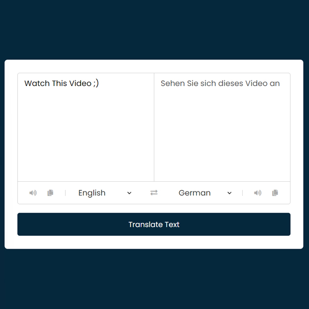

# Day #13

### Translator App
In this tutorial ([Open on YouTube](https://youtu.be/WGRIMv790UI)), I am going to show you how to code a translator app with JavaScript. In this tutorial, we use a translation API to retrieve data, and this code is also responsive! ❗️ In this video, we create a Google Translate clone. 😁

# Screenshot
Here, we have a project screenshot:

