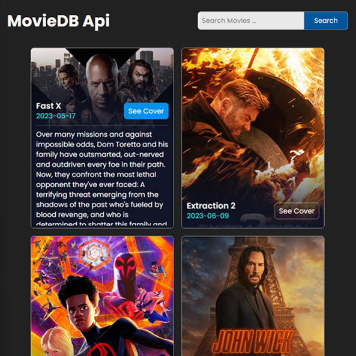

# Day #38

### Movie App (TheMovieDB)
In this tutorial ([Open in Youtube](https://youtu.be/dButm3gpZDA)),  I am gonna showing to you how to code a Movie App using JavaScript. in this video i'm using TheMovieDB api to get movies info. Also this code is fully responsive and when you scroll it will load more results❗️

## Warning
You need to get your own api key (in video we showed how!) and replace it in index.js file on line 1 :

```javascript
const apiKey = "YOUR_API_KEY";
```


# Screenshot
Here we have project screenshot :


