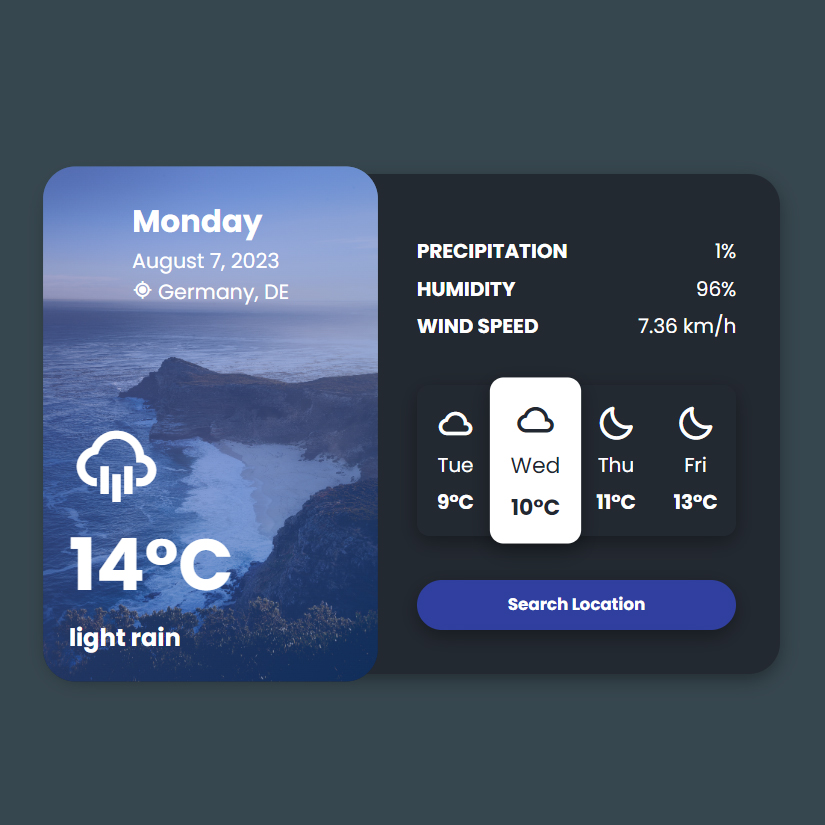

# Day #44

### Minimal Weather App
In this tutorial ([Open in Youtube](https://youtu.be/PvRtd72xagE)), I am gonna showing to you how to add api to Minimal Weather App Ui Design that we coded here (https://youtu.be/qC_DtdhH-J4), i'm used openweather api to connect this app to api to get weather info❗️

## Warning
You need to get your own api key (in video we showed how!) and replace it in index.js file on line 1 :

```javascript
const apiKey = 'YOUR_API_KEY';
```

# Screenshot
Here we have project screenshot :


