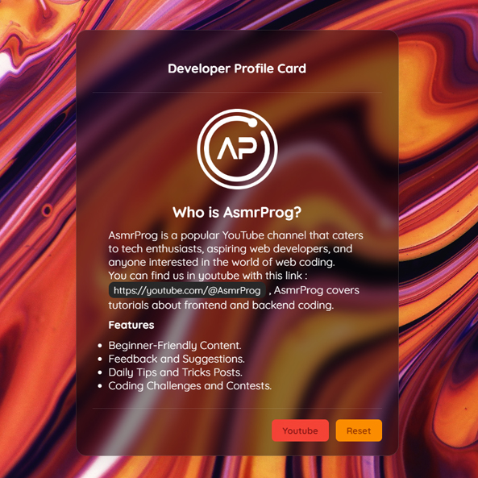

# Day #51

### Draggable Profile Card
In this tutorial ([Open in Youtube](https://youtu.be/HWrKyboQNn4)), I am gonna showing to you how to code a Glassmorphism Profile Card using Html CSS and JavaScript. We use javascript to make this profile card draggable (support drag and drop) ❗️

# Screenshot
Here we have project screenshot :

