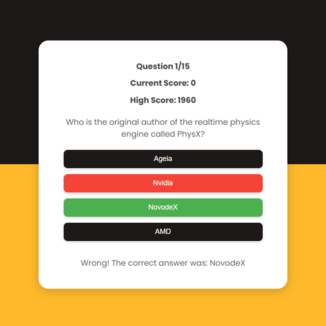

# Day #61

### Api Quiz Game
In this tutorial ([Open in Youtube](https://youtu.be/so_FzCUMlf0)),  I am gonna showing to you how to code a quiz game with html, css and javascript! this game get questions and answers from api and you don't need to manually add questions to it! also you can choose difficulty and category of questions and also number of questions. it also add points to your score depending on time that you answered the question❗️

# Screenshot
Here we have project screenshot :

