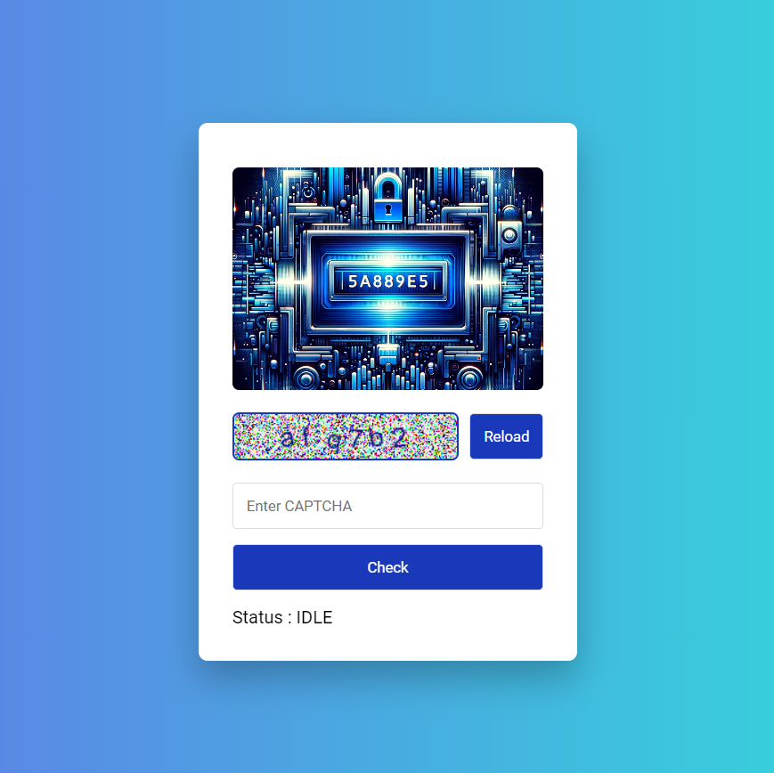

# Day #67

### Captcha App
In this tutorial ([Open in YouTube](https://youtu.be/KPR-s3JIh1Q)),  we delve into the world of captcha using JavaScript. This video is a must-watch for anyone looking to enhance their web development skills, especially in the area of captcha codes❗️

### 🌟 What You'll Learn:
- Understanding Captcha: Learn how captcha codes work!
- How To Add Noise To Captcha
- Working With Canvas

# Screenshot
Here we have project screenshot :

