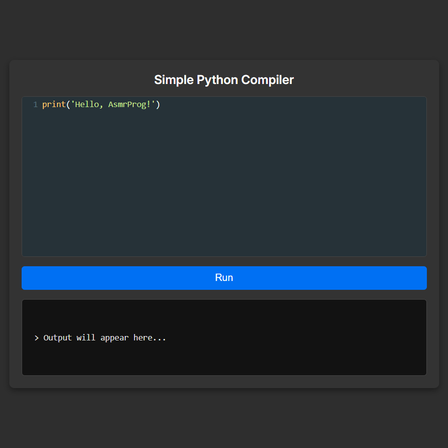

# Day #79

### Simple Python Compiler
Want to build your own Python Compiler with a professional code editor? In this tutorial, we’ll create a Simple Python Compiler using CodeMirror (Python mode) for syntax highlighting, indentation, and smooth code editing! 🚀

🔥 What You’ll Learn:
✅ Integrating CodeMirror (Python Mode) – Set up a feature-rich Python editor with syntax highlighting. ✨
✅ Executing Python Code in Real-Time – Handle user input and display instant output dynamically. 🔄
 Building a User-Friendly UI – Create a responsive and interactive interface for a seamless experience. 🖥️
✅ Optimizing Performance & Security – Ensure fast and secure Python execution in the browser. 🚀

# Screenshot
Here we have project screenshot :

