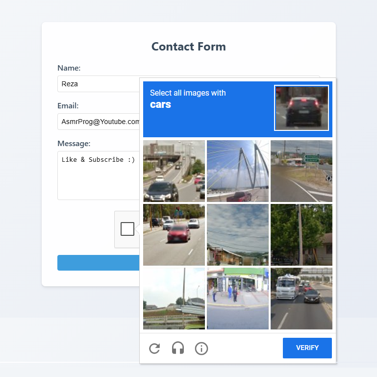
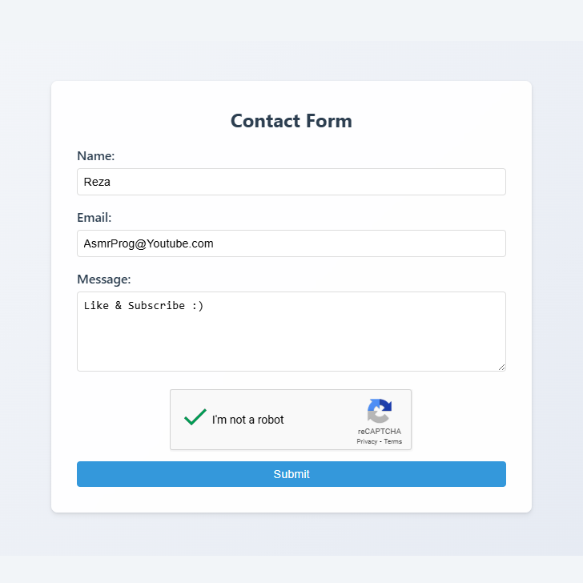

# Day #80

### Google reCAPTCHA
🛡️ Want to Protect Your Forms from Spam and Bots using Google reCAPTCHA? In this tutorial, we’ll integrate Google reCAPTCHA v2 & v3 step-by-step with HTML, JavaScript, and a touch of modern styling! 💻🤖

🔥 What You’ll Learn:
✅ Integrating Google reCAPTCHA – Add powerful spam protection to your forms with just HTML, CSS & JS. 🔐
✅ reCAPTCHA v2 vs v3 – Understand the differences and choose what’s best for your site. 🧠
✅ Seamless User Experience – Keep your UI clean while securing your forms. ✨
✅ Bonus Tips – reCAPTCHA best practices and error handling techniques. 💡

## Warning
You need to get your own api key (in video we showed how!) and replace it in index.html file on line 29 :

```html
<div class="g-recaptcha" data-sitekey="<YOUR_API_KEY>"></div>
```

# Screenshot
Here we have project screenshot :


