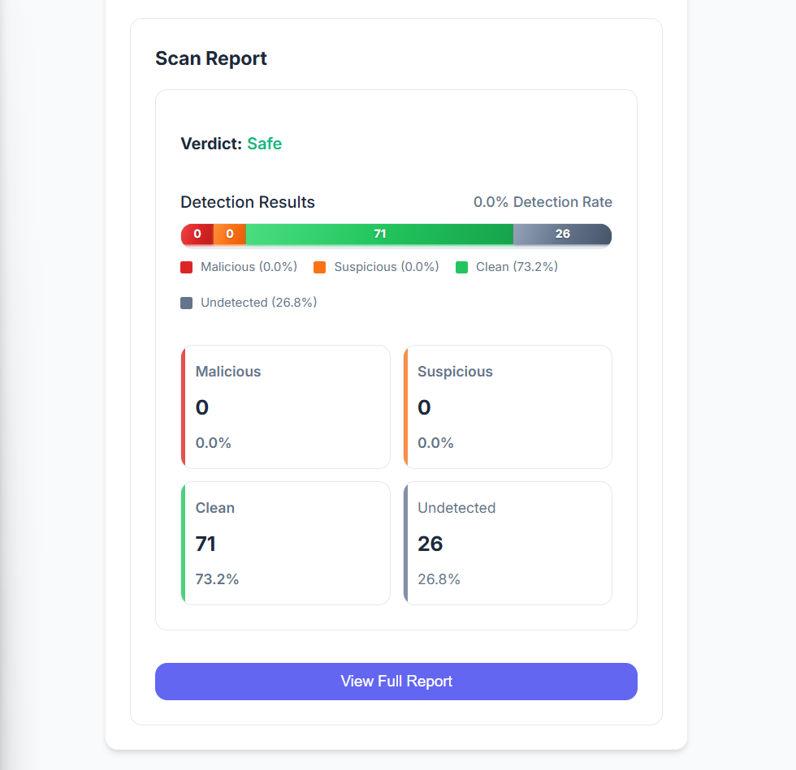

# Day #81

### Virus Total API
🛡️ Want to Scan Files & URLs for Malware Using VirusTotal API? In this tutorial, we’ll build a powerful web tool using HTML, CSS & JavaScript to interact with the VirusTotal API and check for threats in real-time! 💻🦠

🔥 What You’ll Learn:

* VirusTotal API Integration – Learn how to send files and links to VirusTotal and analyze responses using JavaScript. 🔐 
* File & URL Scanning – Check suspicious uploads and URLs with a few lines of code. 🕵️‍♂️ 
* Clean UI Design – Build a simple, user-friendly interface using modern HTML & CSS. ✨ 
* Bonus Tips – API rate limits, error handling, and security best practices. 💡 

💡 Whether you're a developer, ethical hacker, or just curious about malware detection, this hands-on project is the perfect starting point!

## Warning
You need to get your own EmailJS Keys (in video we showed how!) and replace them in script.js file on line 2 :

```javascript
// API key from VirusTotal API
const API_KEY = "YOUR_API_KEY";
```

# Screenshot
Here we have project screenshot :

