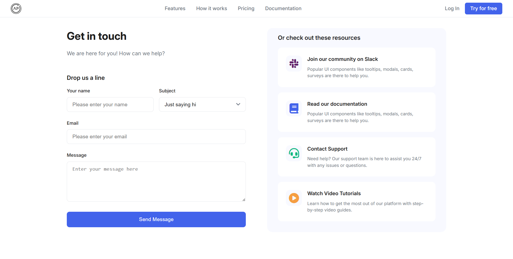

# Day #82

### Contact Form With EmailJS
🛡️ Want to Build a Contact Form with Backend Using EmailJS API? In this tutorial, we’ll create a fully functional contact form using HTML, CSS & JavaScript — no backend server required! 💬📧

🔥 What You’ll Learn:

* EmailJS API Integration – Send emails directly from your frontend using EmailJS, no server needed! ⚙️ 
* Fully Functional Contact Form – Capture name, email, subject, and message in real time. 📩 
* Responsive UI Design – Design a clean, modern, and mobile-friendly contact form using HTML & CSS. 💡 
* Bonus Tips – Input validation, success/failure alerts, and production-ready code. 💪 

💡 Whether you're a beginner looking to build your first web project or a developer exploring serverless tools, this is the perfect hands-on tutorial!

## Warning
You need to get your own EmailJS Keys (in video we showed how!) and replace them in script.js file on line 4 :

```javascript
// Replace this with your EmailJS public key
emailjs.init("EMAILJS_PUBLIC_KEY");
```
and line 27:
```javascript
// Send email using EmailJS
// Replace Service_ID and Template_ID with your EmailJS service and template IDs
emailjs.send('EMAILJS_SERVICE_ID', 'EMAILJS_TEMPLATE_ID', formData).then(function (response) {
```

# Screenshot
Here we have project screenshot :

