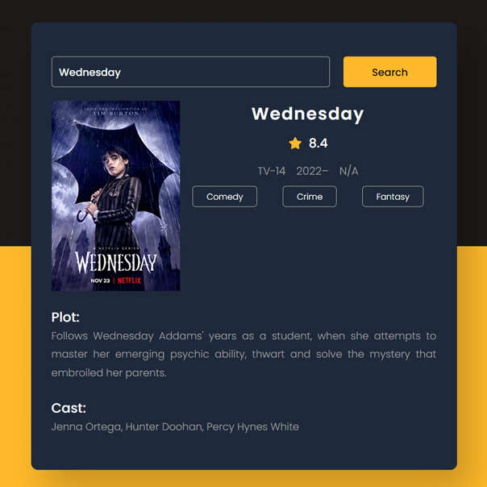

# Day #11

### Movie Info App
In this tutorial ([Open in Youtube](https://youtu.be/J6uam9jEmDU)),  I am gonna showing to you how to code a movie info app with javascript. in this tutorial also we use a movie database api and we get data from api and this code is also responsive❗️

## Warning
You need to get your own api key (in video we showed how!) and replace it in key.js file :

```javascript
key = "Your Api Key";
```


# Screenshot
Here we have project screenshot :

