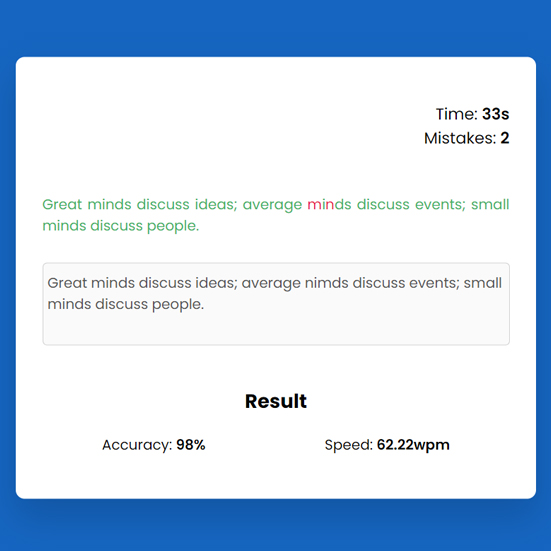

# Day #12

### Type Test App
In this tutorial ([Open in Youtube](https://youtu.be/uWwDO5n9tO8)),  I am gonna showing to you how to code a speed test app with javascript. in this tutorial also we use a quote database api and we get data from api and this code is also responsive❗️This javascript typing speed test app also show how many words you type per minutes!

# Screenshot
Here we have project screenshot :

