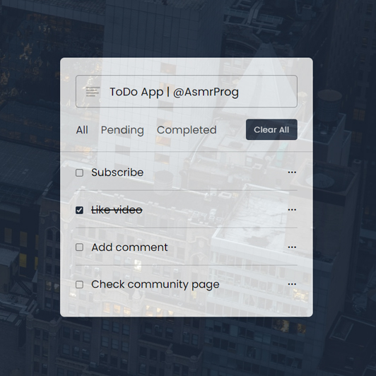

# Day #15

### ToDo App
In this tutorial ([Open in Youtube](https://youtu.be/0Ao1UN1WSCw)),  I am gonna showing to you how to code a ToDo app with javascript. this todo app also have some features such as clear all button and edit and delete button and you can see All, Pending and completed tasks in seperate tabs❗️

# Screenshot
Here we have project screenshot :

