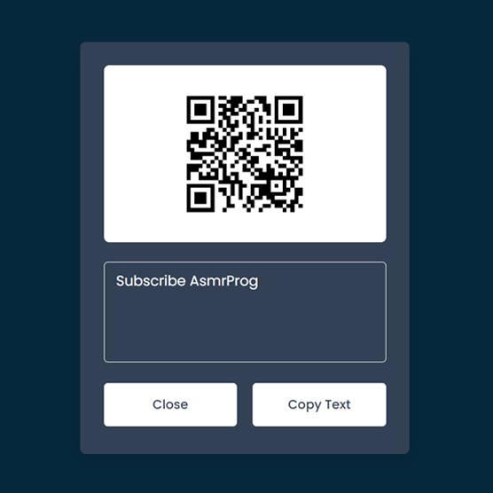

# Day #20

### QR Code Reader
In this tutorial ([Open in Youtube](https://youtu.be/e13YYMna74s)),  I am gonna showing to you how to build a QR Code Reader with javascript. this qr code reader also use QR Reader api and you can read qr codes that we generate with day #4 of 100 days❗️

#### Day #4 Link

<a href="https://github.com/AsmrProg-YT/100-days-of-javascript/tree/master/Day%20%2304%20-%20QR%20Code%20Generator" target="_blank">QR Code Generator Source</a>

# Screenshot
Here we have project screenshot :

