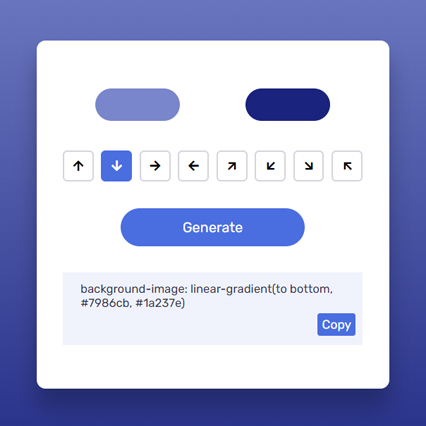

# Day #22

### Gradient Generator
In this tutorial ([Open in Youtube](https://youtu.be/zUOunkcZcjI)),  I am gonna showing to you how to code a gradient generator app with javascript. with this javascript gradient generator you can generate gradients with codes and use it in your site design projects❗️

# Screenshot
Here we have project screenshot :

