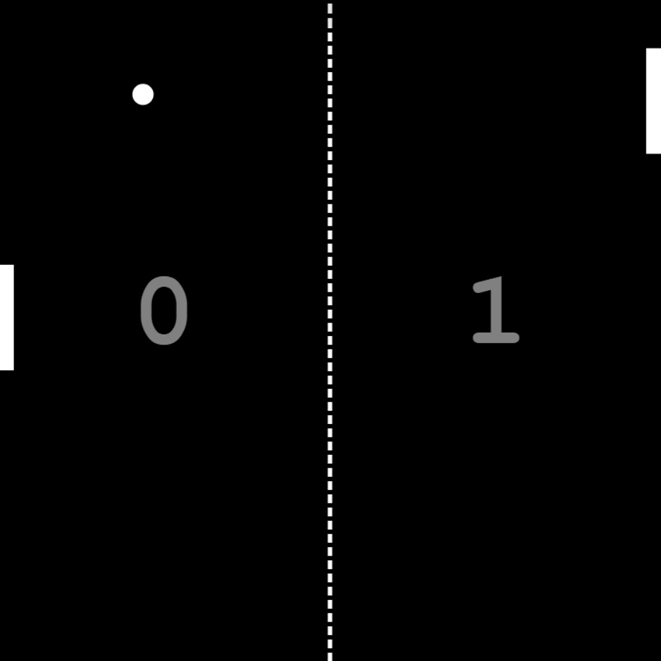

# Day #33

### Pong Game
In this tutorial ([Open in Youtube](https://youtu.be/wQHVJjrwLhA)),  I am gonna showing to you how to code a pong game with javascript. we create a project that you can play ping pong game with javascript❗️

### Make Game Easier

To make the game easier, we can adjust the speed of the computer paddle to make it less responsive to the ball's movement. You can modify the line ```com.y += (ball.y - (com.y + com.height / 2)) * 0.1;``` in the ```update()``` function to reduce the factor ```0.1``` to a smaller value. This will make the computer paddle move slower and make the game easier to win. Here's an example with a reduced factor of ```0.05``` :

```javascript
// Update the game logic
function update() {
  // Check for scoring and reset the ball if necessary
  if (ball.x - ball.radius < 0) {
    com.score++;
    resetBall();
  } else if (ball.x + ball.radius > canvas.width) {
    user.score++;
    resetBall();
  }

  // Update ball position
  ball.x += ball.velocityX;
  ball.y += ball.velocityY;

  // Update computer paddle position based on ball position (adjusted to slower speed)
  com.y += (ball.y - (com.y + com.height / 2)) * 0.05;

  // Reflect ball off top and bottom walls
  if (ball.y - ball.radius < 0 || ball.y + ball.radius > canvas.height) {
    ball.velocityY = -ball.velocityY;
  }

  // Determine which paddle is being hit by the ball and handle collision
  let player = ball.x + ball.radius < canvas.width / 2 ? user : com;
  if (collision(ball, player)) {
    const collidePoint = ball.y - (player.y + player.height / 2);
    const collisionAngle = (Math.PI / 4) * (collidePoint / (player.height / 2));
    const direction = ball.x + ball.radius < canvas.width / 2 ? 1 : -1;
    ball.velocityX = direction * ball.speed * Math.cos(collisionAngle);
    ball.velocityY = ball.speed * Math.sin(collisionAngle);

    // Increase ball speed and limit to max speed
    ball.speed += 0.2;
    if (ball.speed > maxBallSpeed) {
      ball.speed = maxBallSpeed;
    }
  }
}
```


# Screenshot
Here we have project screenshot :

