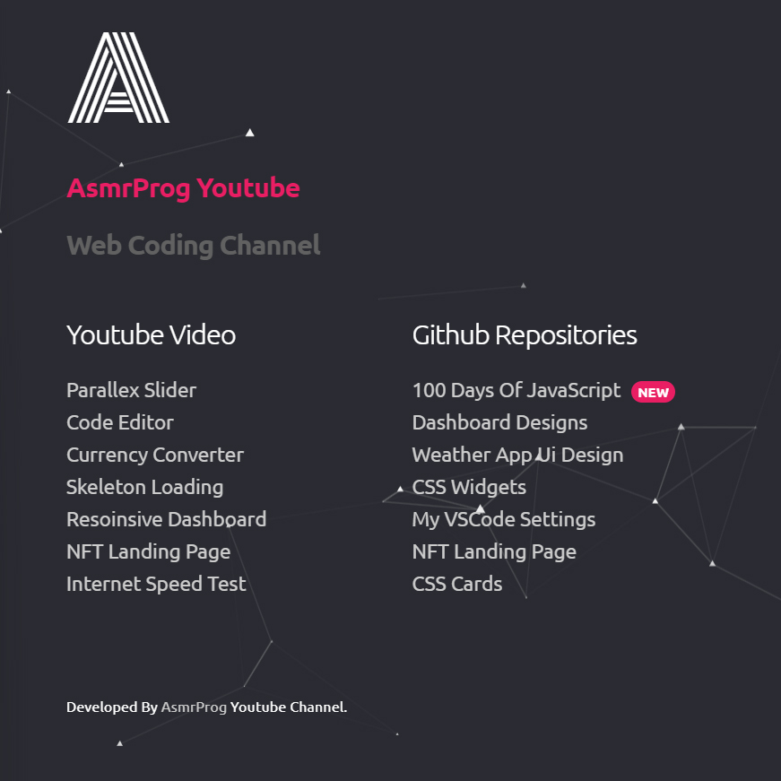

# Day #45

### Particles Portfolio
In this tutorial ([Open in Youtube](https://youtu.be/kE6EnyHo2A8)), I am gonna showing to you how to code a portfolio with particles.js background animation, Also in this video we used Skeleton.css for our grids. Hope you enjoy it❗️

# Screenshot
Here we have project screenshot :

