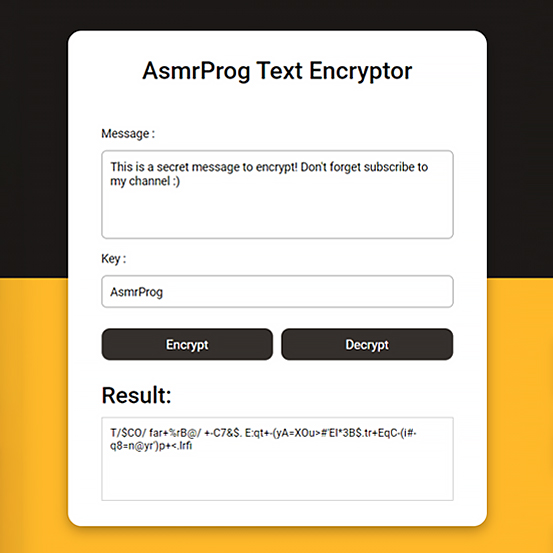

# Day #47

### Text Encryptor
In this tutorial ([Open in Youtube](https://youtu.be/v6XdqdByL5c)), I am gonna showing to you how to code a text encryptor using javascript. with this text encryptor you can encrypt your text using random passwords and make it secure and only who know password can decrypt text❗️

# Screenshot
Here we have project screenshot :

