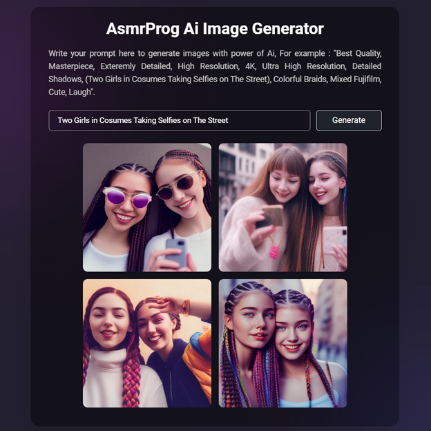

# Day #48

### Ai Image Generator
In this tutorial ([Open in Youtube](https://youtu.be/KBbeUCQXBys)), I am gonna showing to you how to code your own ai image generator completely free! we will use huggingface api to create our own ai image generator app❗️

## Warning
You need to get your own api key (in video we showed how!) and replace it in script.js file on line 1 :

```javascript
const apiKey = "YOUR_API_KEY";
```


# Screenshot
Here we have project screenshot :


