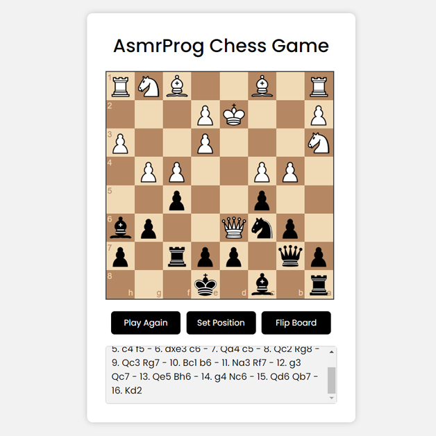

# Day #49

### Chess Game (VS Computer)
In this tutorial ([Open in Youtube](https://youtu.be/XaFYLIEq4E8)), I am gonna showing to you how to code a chess game with javascript. in this javascript chess game you can play with computer, flip board and set position. in this code you will learn to use chessboardjs and chess.js library❗️

# FEN Notation

FEN (Forsyth-Edwards Notation) is a standard notation used to represent a particular chessboard position. It provides a concise and human-readable way to describe the placement of chess pieces on the board, as well as other important information about the position. Here's how FEN notation works:

A FEN string consists of six fields separated by spaces:

1. **Piece Placement (8 ranks)**: This field represents the positions of the pieces on the board. Each rank is represented by a series of characters, where:
   - `K` represents a white king.
   - `Q` represents a white queen.
   - `R` represents a white rook.
   - `B` represents a white bishop.
   - `N` represents a white knight.
   - `P` represents a white pawn.
   - `k` represents a black king.
   - `q` represents a black queen.
   - `r` represents a black rook.
   - `b` represents a black bishop.
   - `n` represents a black knight.
   - `p` represents a black pawn.
   - Digits (1-8) represent empty squares, with the number indicating the count of consecutive empty squares.

   For example, `rnbqkbnr/pppppppp/8/8/8/8/PPPPPPPP/RNBQKBNR` represents the starting position of a chess game.

2. **Active Color (1 character)**: This field indicates which player's turn it is to move. `w` represents White's turn, and `b` represents Black's turn.

3. **Castling Availability (1-4 characters)**: This field indicates whether castling is still available for each player. The characters used are:
   - `K` for White kingside castling.
   - `Q` for White queenside castling.
   - `k` for Black kingside castling.
   - `q` for Black queenside castling.
   - `-` if no castling is possible.

4. **En Passant Target Square (1-2 characters)**: If a pawn has just moved two squares forward from its starting position, this field represents the square where the opposing pawn can capture en passant. Otherwise, it is represented as `-`.

5. **Halfmove Clock (1-2 characters)**: This field represents the number of half-moves (ply) since the last pawn move or capture. It is used for the fifty-move rule.

6. **Fullmove Number (1-2 characters)**: This field represents the number of full moves (complete turns) in the game. It starts at 1 and is incremented after Black's move.

Here's an example FEN string:
```
rnbqkb1r/ppp1pppp/5n2/3p4/3P4/8/PPP2PPP/RNBQKBNR w KQkq - 0 4
```
This FEN represents a specific board position where it's White's turn to move, both sides have the potential to castle kingside and queenside, there's no en passant target square, the halfmove clock is 0, and the fullmove number is 4.

You can use FEN notation to record and share specific chess positions and use them for various purposes, including setting up custom positions for analysis or practice.

# Screenshot
Here we have project screenshot :


