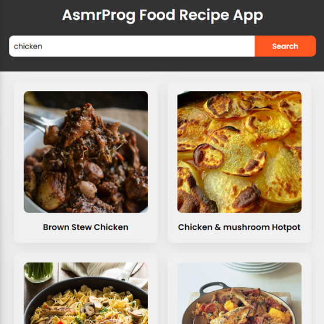

# Day #50

### Food Recipe Website
In this tutorial ([Open in Youtube](https://youtu.be/VRgA9NkhSEk)), I am gonna showing to you how to code a food recipe app using javascript. also this project is fully responsive and you can use it in your website coding ❗️

# Screenshot
Here we have project screenshot :

