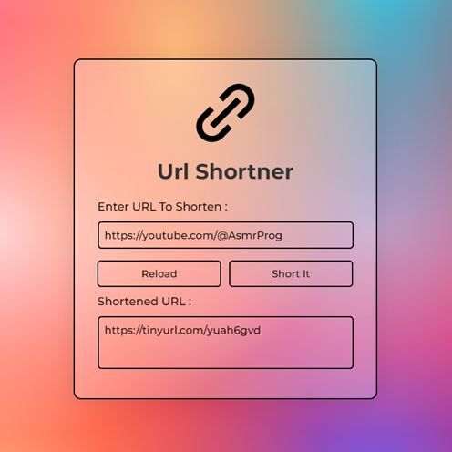

# Day #53

### Url Shortner
In this tutorial ([Open in Youtube](https://youtu.be/DFZ2SX0-Ou4)),  I am gonna showing to you how to code a url shortner with api in javascript! Also we have a great mesh gradient background and glassmorphism design for it and we used tinyurl website api❗️

# Screenshot
Here we have project screenshot :

