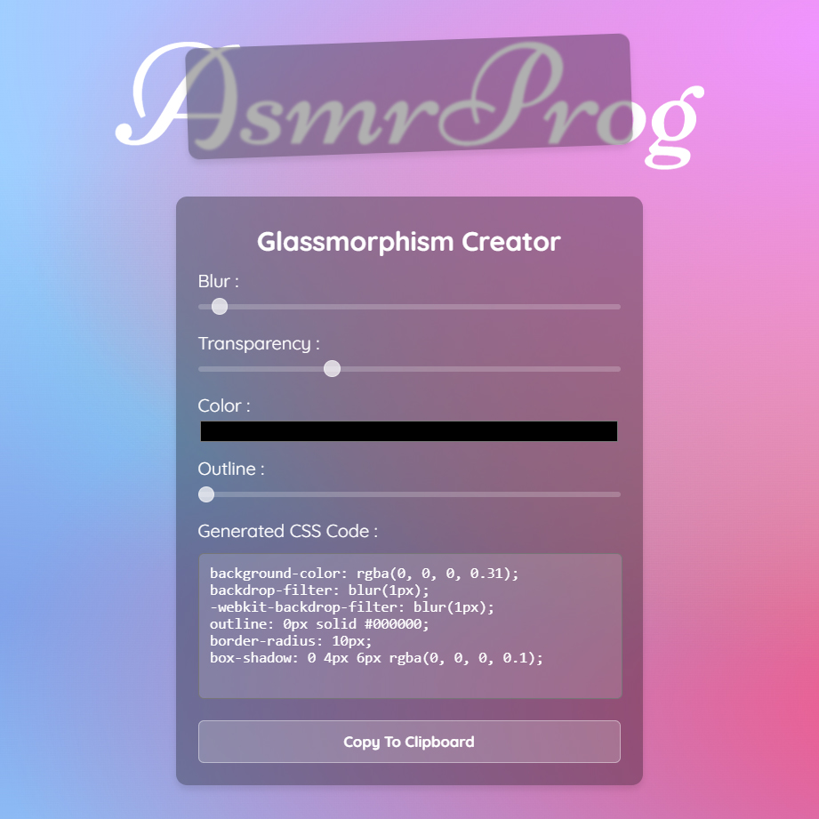

# Day #54

### Glassmorphism Generator
In this tutorial ([Open in Youtube](https://youtu.be/oVAet9CRwqI)),  I am gonna showing to you how to code a Glassmorphism Generator with html, css and javascript! With this tutorial you can create your own glassmorphism generator and use it in your websites to create awesome web designs❗️

# Screenshot
Here we have project screenshot :

