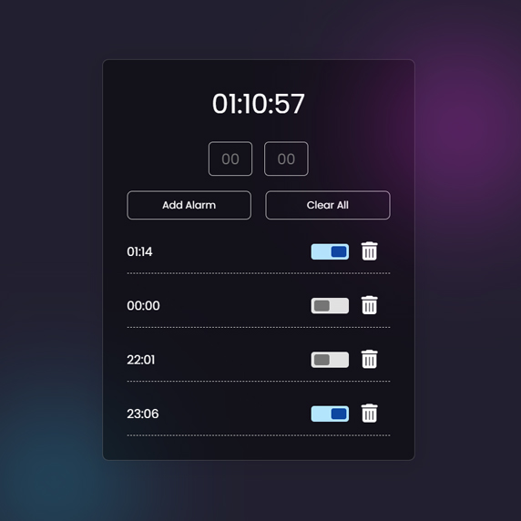

# Day #55

### Alarm App
In this tutorial ([Open in Youtube](https://youtu.be/J_exGTc7CEU)),  I am gonna showing to you how to code a Alarm App with html, css and javascript! With this tutorial you can create your own responsive alarm app and set alarms in it, then on time it's starts ringing❗️

# Screenshot
Here we have project screenshot :

