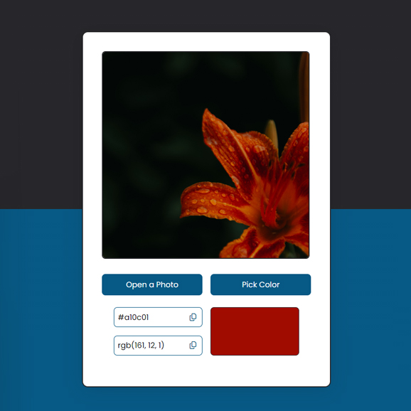

# Day #56

### Image Color Picker
In this tutorial ([Open in Youtube](https://youtu.be/ENFIrHO83Xg)),  I am gonna showing to you how to code a image color picker app with html, css and javascript. with this color picker app you can open image and pick any color that you want with Eyedropper. in this video you will learn eyedropper api❗️

# Screenshot
Here we have project screenshot :

