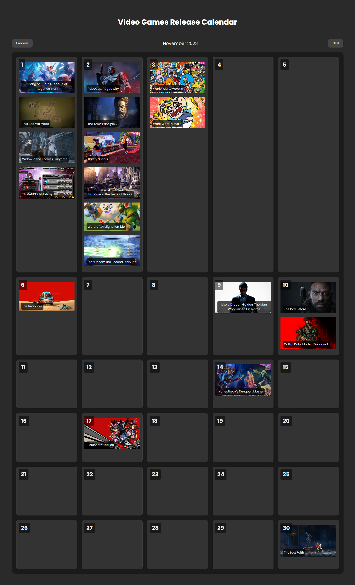

# Day #58

### Games Release Calendar
In this tutorial ([Open in Youtube](https://youtu.be/4soJ_kW487s)),  I am gonna showing to you how to code responsive video games release calendar using html, css and javascript! this project also is have a great dark theme, with this calendar you can know previous and next month upcoming video games and we will use rawg api in it❗️

## Warning
You need to get your own api key (in video we showed how!) and replace it in index.js file on line 1 :

```javascript
const API_KEY = 'Your_Api_Key';
```


# Screenshot
Here we have project screenshot :


