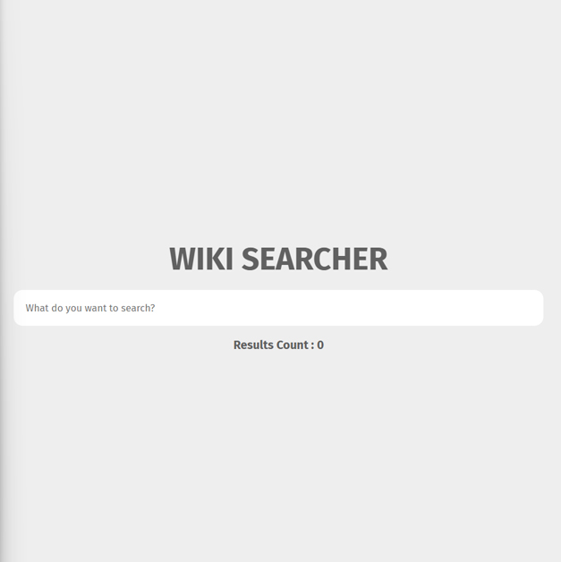

# Day #60

### Wikipedia Searcher
In this tutorial ([Open in Youtube](https://youtu.be/v1t3STcPRqI)),  I am gonna showing to you how to code a wikipedia search app in javascript! you will learn how to use wikipedia api to search around wikipedia wih html css and js, this project also is fully responsive❗️

# Screenshot
Here we have project screenshot :

