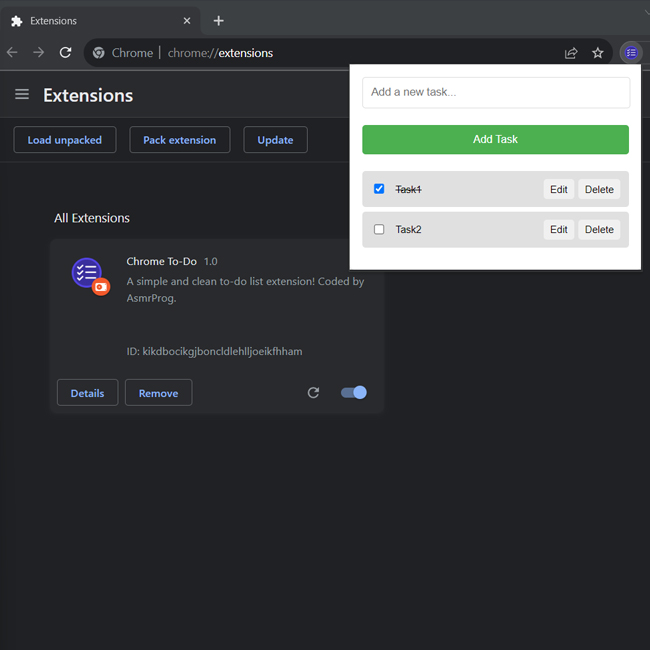

# Day #62

### Chrome ToDo Extension
In this tutorial ([Open in Youtube](https://youtu.be/ny-L_KLrKIU)),  I am gonna showing to you how to code a chrome extension with javascript. we will create a simple todo app extension for chrome using html, css and javascript❗️

# Screenshot
Here we have project screenshot :

