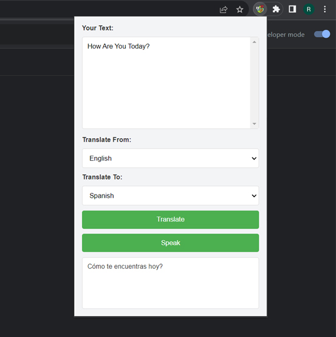

# Day #63

### Chrome Translator Extension
In this tutorial ([Open in Youtube](https://youtu.be/KHkNc67c5Mc)),  I am gonna showing to you how to code a chrome extension with javascript. we will create a language translator extension for chrome using html, css and javascript❗️

# Screenshot
Here we have project screenshot :

