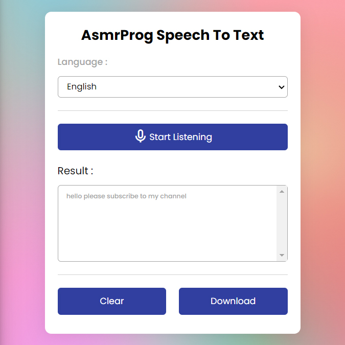

# Day #64

### Chrome Translator Extension
In this tutorial ([Open in Youtube](https://youtu.be/4-kXrePE2xs)),  I am gonna showing to you how to code a speech to text app. we will code an app that you can speak and it write text for you,we code this speech to text in html, css and javascript❗️

# Screenshot
Here we have project screenshot :

