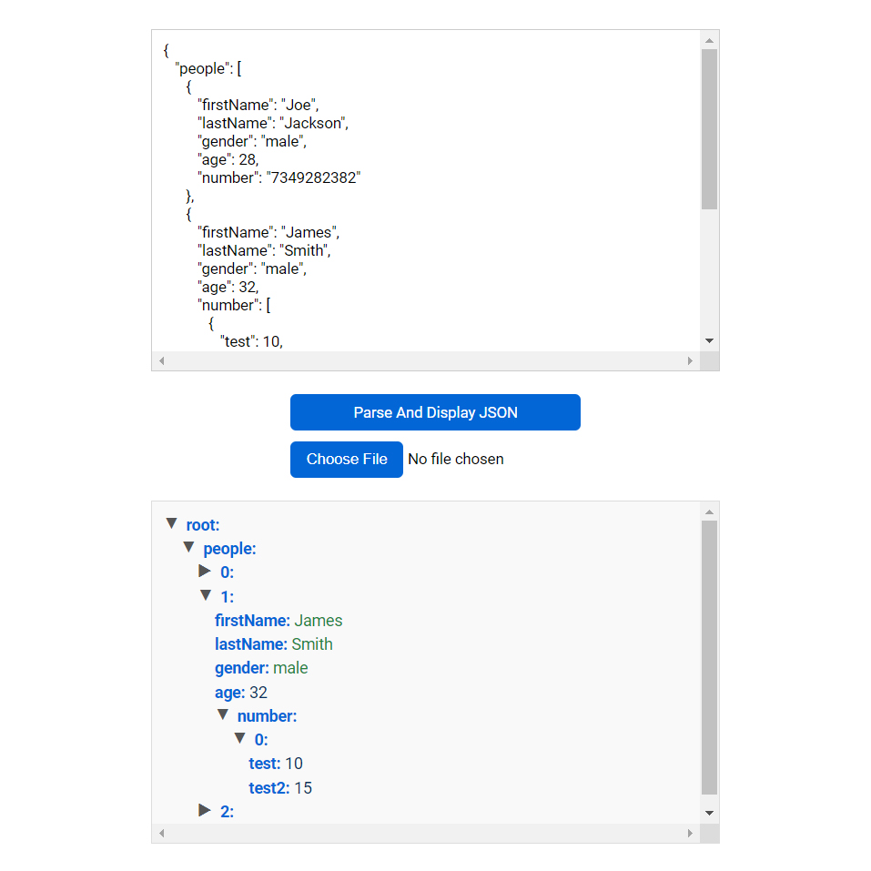

# Day #68

### JSON Parser
In this tutorial ([Open in YouTube](https://youtu.be/pX1xymfEH-Q)),  we delve into the world of json files in JavaScript. This video is a must-watch for anyone looking to enhance their web development skills, especially in the area of json codes, json parsing is most important thing when you want to work with api❗️

### 🌟 What You'll Learn:
- Understanding JSON: Learn how to parse json files!
- How to get type of data
- Working with all json types

# Screenshot
Here we have project screenshot :

