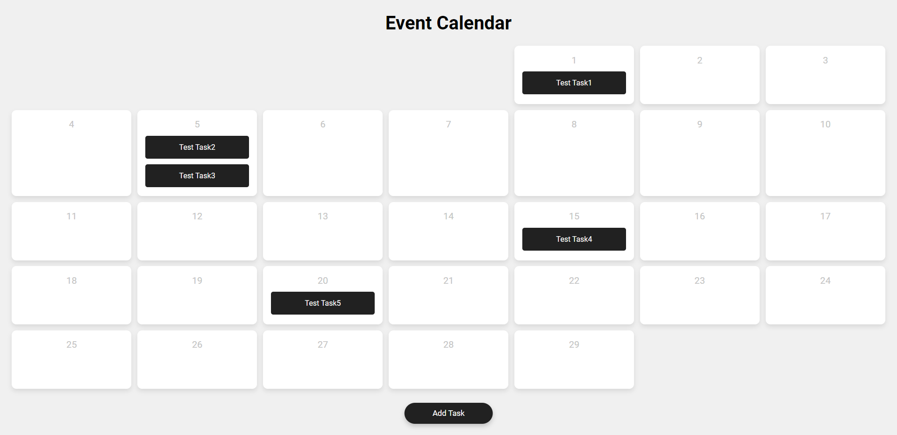

# Day #70

### Calendar With Events
In this tutorial ([Open in YouTube](https://youtu.be/QiVoPKzylck)), we'll dive deep into the world of JavaScript and demonstrate how to build a dynamic calendar that not only displays dates but also allows users to add, edit, and delete events with ease. 💻🌟
 
You'll learn how to leverage the power of JavaScript to handle user interactions, manipulate the DOM, and manage event data effectively. We'll cover topics such as event listeners, DOM manipulation, date handling, and more, providing you with the essential knowledge to create a fully functional event calendar from scratch.
 
Whether you're building a personal planner, scheduling app, or integrating a calendar into your website, this tutorial has got you covered. So grab your favorite coding tools, fire up your text editor, and let's dive into the world of JavaScript event calendars together! 🔥 Don't forget to like, share, and subscribe for more awesome tutorials! 🚀

# Screenshot
Here we have project screenshot :

