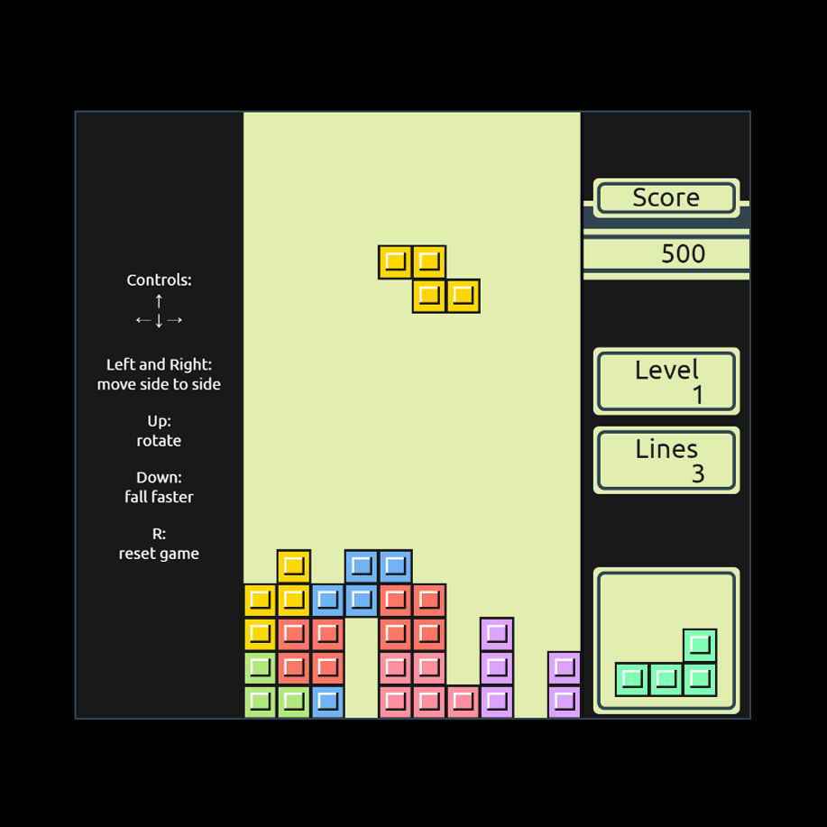

# Day #73

### Gameboy Tetris Clone
In this tutorial ([Open in Youtube](https://youtu.be/oNjkDTOj-n8)), we'll explore the process of recreating the iconic Tetris experience right in your browser. From designing the layout with HTML to styling it with CSS for that retro vibe, to implementing the game logic with JavaScript, every step is covered to help you understand the magic behind this timeless game.

Join us as we delve into the code, unraveling the secrets of game mechanics and user interactions. Whether you're a seasoned developer looking to brush up on your skills or a Tetris enthusiast eager to relive the thrill of stacking blocks, this tutorial has something for everyone.

So grab your virtual Gameboy and let's embark on this coding adventure together! Don't forget to like, subscribe, and hit the bell icon for more exciting content. Happy coding and happy gaming! 🚀🎮

# Screenshot
Here we have project screenshot :

