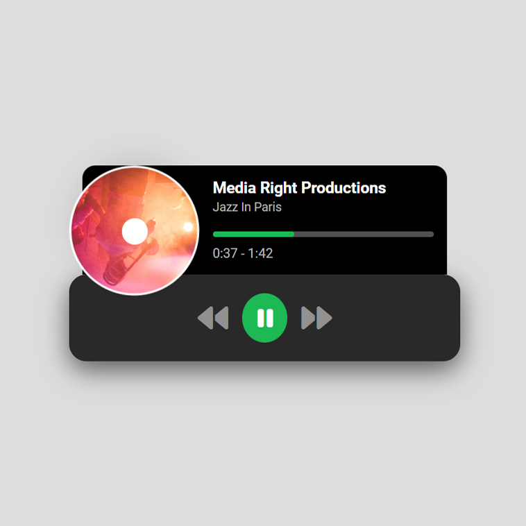

# Day #75

### Mini Music Player
In this tutorial ([Open in Youtube](https://youtu.be/SAzB_M2wpR0)), We will work on building a mini music player from scratch! In this beginner-friendly video, we'll walk you through the step-by-step process of creating a fully functional music player using HTML, CSS, and JavaScript.

Here's what you'll learn:

🔹 Setting up the basic structure of our HTML file to accommodate the music player.
🔹 Styling our music player with CSS to make it visually appealing and user-friendly.
🔹 Implementing JavaScript functionality to handle play, pause, next and previous.
🔹 Enhancing user experience with additional features like track progress control.

# Screenshot
Here we have project screenshot :

