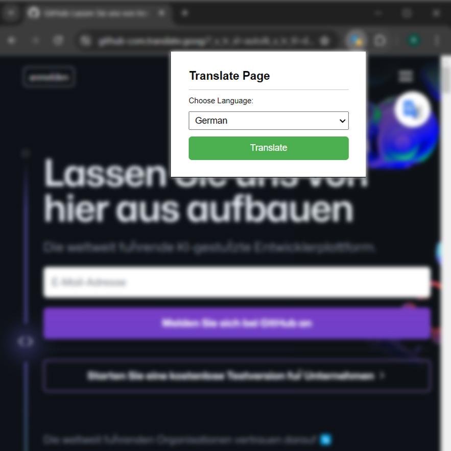

# Day #76

### Page Translator Extension
In this tutorial ([Open in Youtube](https://youtu.be/ZgjWHabI8Fs)),  In this tutorial, we'll walk you through the step-by-step process of creating a fully functional page translator using HTML, CSS, and JavaScript.️

#### Here's what you'll learn:

🔹 Setting up the basic structure of our extension, including the manifest file.

🔹 Designing the extension popup with HTML and CSS for a clean and intuitive interface.

🔹 Implementing JavaScript to handle translation requests and inject translations into web pages.

🔹 Integrating with translation APIs to provide accurate and reliable translations.

# Screenshot
Here we have project screenshot :

