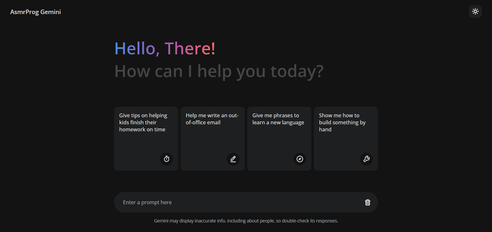

# Day #78

### Google Gemini Clone
Build your own Generative AI App using Google Gemini API with Vanilla JavaScript. Create AI App like Google Gemini or ChatGPT step by step tutorial.

In this tutorial ([Open in Youtube](https://youtu.be/Klcpzw_nvLU)), you will learn to create your own Generative AI app like Google Gemini or ChatGPT using vanilla JavaScript. In this step-by-step tutorial, we will create a Gemini clone app using the Gemini API for absolutely free. You can build this Google Gemini app for your college project or personal portfolio.

- Introduction to AI-Powered Chat Apps: Learn how to create a generative AI app similar to Google Gemini or ChatGPT using vanilla JavaScript. 🤖
- Connecting with the Gemini API: Discover how to use the Gemini API to add AI capabilities to your app, allowing for natural language conversations and responses. 🌐
- Step-by-Step JavaScript Implementation: Follow our detailed guide, from setting up your project to implementing AI-powered chat features using vanilla JavaScript. 💻
- User-Friendly Interface: Design a sleek, responsive interface for an engaging chat experience, ensuring smooth interactions and real-time responses. 🌟
- Optimizing Performance: Learn how to keep your AI chat app efficient, running smoothly across different devices and platforms. 📱

## Warning
You need to get your own **API Key** (in video we showed how!) and replace it in script.js file on line 12 :

```javascript
const GOOGLE_API_KEY = "YOUR_API_KEY";
```

# Screenshot
Here we have project screenshot :

